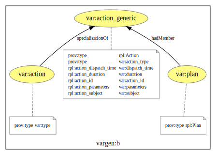
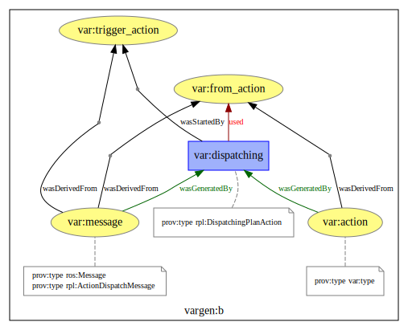
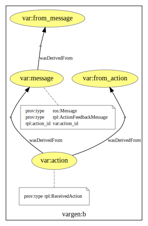
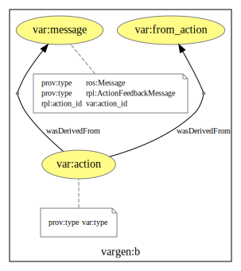

# Templates for ROSPlan Provenance Recording

## An action in a plan

- [Bindings configuration](plan_action_bindings.json))

## An action is dispatched

- [Bindings configuration](action_dispatched_bindings.json))

## An action is acknowledged as received (after being dispatched)

- [Bindings configuration](action_received_bindings.json))

## An action is acknowledged as completed

- [Bindings configuration](action_completed_bindings.json))
